<div align="center">

# 🎓 Instituto Tecnológico de Oaxaca

---

# Sistema Escolar
## Actividad 5. Proyecto de Login


### Descripción del proyecto

Sistema web que simula el acceso a un sistema escolar sin base de datos.
Incluye una pantalla de login, un panel principal,
y un módulo de captura de alumno con validaciones, modal de mayoría de edad,
eliminación por número de control y persistencia con arreglos y localStorage.

---

### Integrantes del equipo

| Nombre |
|---|
| Cruz Santiago Roque Antonio |
| Cortés Cruz Jesús |

| | |
|---|---|
| **Materia** | _Programación web_ |
| **Docente** | _Adelina Martinez Nieto_ |
| **Grupo** | _7SD_ |


</div>


## 1. Tecnologías y framework CSS

| Tecnología | Versión | Uso |
|---|---|---|
| **Bootstrap** (framework CSS) | 5.3.3 | Diseño, grid, formularios, navbar, dropdown, collapse y modales |
| **Bootstrap Icons** | 1.11.3 | Íconos del menú, botones y alertas |
| **JavaScript** (vanilla) | ES6+ | Lógica del login, validaciones y manejo del DOM |
| **utileria.js** | — | Librería del profesor: `validarCorreo()` y `validarPassword()` |
| **sessionStorage** | — | Guarda la sesión del usuario logueado |
| **localStorage** | — | Guarda el arreglo de alumnos |
| **JSON** | — | Archivo `data/usuarios.json` con los usuarios válidos |

### Framework CSS utilizado: Bootstrap 5.3.3

Se carga por CDN en el `<head>` de ambas pantallas:

```html
<link href="https://cdn.jsdelivr.net/npm/bootstrap@5.3.3/dist/css/bootstrap.min.css" rel="stylesheet">
<link rel="stylesheet" href="https://cdn.jsdelivr.net/npm/bootstrap-icons@1.11.3/font/bootstrap-icons.css">
```

Y el JavaScript de Bootstrap (necesario para el dropdown, el collapse y los modales) al final del `<body>`:

```html
<script src="https://cdn.jsdelivr.net/npm/bootstrap@5.3.3/dist/js/bootstrap.bundle.min.js"></script>
```

Además de Bootstrap se crearon hojas de estilo propias (`css/login.css` y `css/index.css`) con variables CSS, colores consistentes entre pantallas y reglas responsivas.

---

## 2. Estructura del proyecto

```
Actividad5/
├── index.html            ← Panel principal del sistema
├── login.html            ← Pantalla de inicio de sesión
├── README.md             ← Este documento
├── css/
│   ├── index.css         ← Estilos del panel principal
│   └── login.css         ← Estilos del login
├── js/
│   ├── index.js          ← Lógica del panel principal
│   └── login.js          ← Lógica del login
├── data/
│   └── usuarios.json     ← Usuarios válidos (base de datos simulada)
└── img/                  ← Capturas de pantalla del README
```

| Archivo | Para qué sirve | Dónde se usa |
|---|---|---|
| `login.html` | Estructura de la pantalla de login | Primera pantalla del sistema |
| `css/login.css` | Estilos de la tarjeta, cabecera y campos del login | Solo en `login.html` |
| `js/login.js` | Valida credenciales, crea la sesión y redirige | Al final de `login.html` |
| `data/usuarios.json` | Lista de usuarios válidos | Lo lee `login.js` con `fetch()` |
| `index.html` | Panel principal: navbar, sidebar y captura de alumnos | Después de iniciar sesión |
| `css/index.css` | Layout, sidebar, navbar y formulario | Solo en `index.html` |
| `js/index.js` | Verifica sesión, muestra el usuario, sidebar, formulario, modales y persistencia | Al final de `index.html` |

---

## 3. Explicación y documentación

### 3.1 Cómo fluye el login hacia el sistema

```
login.html  →  login.js  →  data/usuarios.json  →  sessionStorage  →  index.html  →  index.js
 (escribe       (valida)      (lista de usuarios)    (guarda sesión)    (abre el        (verifica
  datos)                                                                 sistema)        sesión)
```

**Paso 1. Al iniciar sesión (`login.js`):** lee la lista de usuarios, busca una coincidencia por usuario **o** correo más contraseña, y si existe guarda la sesión y redirige.

```js
const encontrado = usuarios.find(u =>
  (u.usuario.toLowerCase() === entrada || u.correo.toLowerCase() === entrada) &&
  u.password === password
);

sessionStorage.setItem("usuarioActual", JSON.stringify({
  usuario: encontrado.usuario,
  nombre: encontrado.nombre,
  correo: encontrado.correo      // la contraseña nunca se guarda
}));

window.location.href = "index.html";
```

**Paso 2. Al cargar `index.html` (`index.js`):** verifica que exista la sesión. Si no existe, regresa al login. El `body` arranca oculto (`class="d-none" id="appBody"`) para que no se vea un parpadeo antes de la validación.

```js
const sesionRaw = sessionStorage.getItem("usuarioActual");

if (!sesionRaw) {
  window.location.href = "login.html";
  return;
}

let sesion = JSON.parse(sesionRaw);
document.getElementById("appBody").classList.remove("d-none");
```

**Paso 3. Al salir:** se elimina la sesión y se regresa al login.

```js
btnSalir.addEventListener("click", (e) => {
  e.preventDefault();
  sessionStorage.removeItem("usuarioActual");
  window.location.href = "login.html";
});
```

### 3.2 Cómo se pasa el nombre de usuario del login al navbar

El canal de comunicación entre las dos pantallas es **`sessionStorage`**, con la clave `usuarioActual`:

1. `login.js` guarda un objeto JSON con `usuario`, `nombre` y `correo`.
2. `index.js` lo lee con `sessionStorage.getItem("usuarioActual")` y lo convierte con `JSON.parse()`.
3. Inserta el nombre en el navbar:

```js
nombreUsuarioNav.textContent = sesion.nombre || sesion.usuario || "Usuario";
```

El navbar pasa de mostrar el texto genérico `Usuario` a mostrar, por ejemplo, `Roque Antonio`. La sesión se borra al cerrar la pestaña.

### 3.3 Métodos principales

| Método / función | Dónde | Qué hace |
|---|---|---|
| `fetch()` | `login.js` | Lee `data/usuarios.json` |
| `Array.find()` | `login.js` | Busca el usuario que coincide con lo escrito |
| `sessionStorage.setItem()` / `getItem()` / `removeItem()` | `login.js`, `index.js` | Crea, lee y borra la sesión |
| `JSON.stringify()` / `JSON.parse()` | `login.js`, `index.js` | Convierte objetos a texto y viceversa |
| `validarCorreo()` | `utileria.js` | Verifica el formato del correo |
| `validarPassword()` | `utileria.js` | Verifica contraseña segura (8 caracteres, mayúscula, minúscula, número y símbolo) |
| `setCustomValidity()` | `index.js` | Marca los campos del formulario como válidos o inválidos |
| `classList.toggle()` | `index.js` | Abre y cierra el sidebar con el botón hamburguesa |
| `new bootstrap.Modal()` / `.show()` | `index.js` | Muestra los modales de edad y eliminación |
| `Array.push()` | `index.js` | Agrega un alumno al arreglo |
| `Array.findIndex()` y `Array.splice()` | `index.js` | Busca y elimina un alumno por número de control |
| `localStorage.setItem()` / `getItem()` | `index.js` | Guarda y recupera el arreglo de alumnos |

---

## 4. Proceso de creación (paso a paso)

### Paso 1. Repositorio y trabajo en equipo

Se creó el repositorio **Actividad5** en GitHub y se invitó al otro integrante como colaborador. Cada integrante clonó el proyecto y trabajó con este flujo:

```bash
git pull
git add .
git commit -m "descripción del cambio"
git push
```

### Paso 2. Armar el login

**2.1 `login.html`.** Se creó una tarjeta centrada con cabecera (ícono, título y subtítulo), una alerta de error oculta  y un formulario con dos campos: usuario o correo, y contraseña con botón para mostrarla u ocultarla.

**2.2 `css/login.css`.** Se definieron variables con los mismos colores del navbar y sidebar del sistema, la tarjeta de hasta `480px`, la cabecera oscura y reglas responsivas para celular:

```css
:root {
  --login-dark: #212529;
  --login-gray: #6c757d;
  --login-bg: #f5f7fa;
}
```

**2.3 `data/usuarios.json`.** Se creó la "base de datos" simulada como un arreglo de objetos:

```json
[
  { "usuario": "admin", "correo": "admin@itoaxaca.edu.mx", "password": "admin123", "nombre": "Administrador" }
]
```

**2.4 `js/login.js`.** Se programó la lectura del JSON, la validación del formulario, la búsqueda del usuario, el mensaje de error, el botón del ojo y la creación de la sesión.

**Usuarios de prueba:**

| Usuario | Contraseña |
|---|---|
| `admin` | `admin123` |
| `roque` | `1234` |
| `jesus` | `1234` |

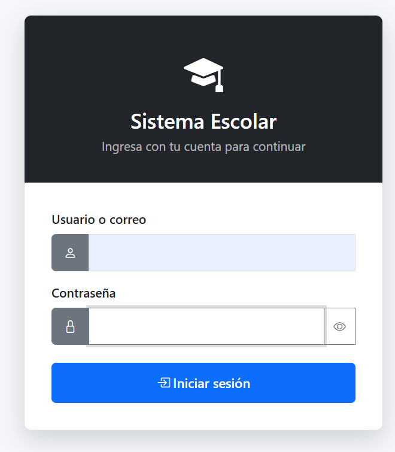

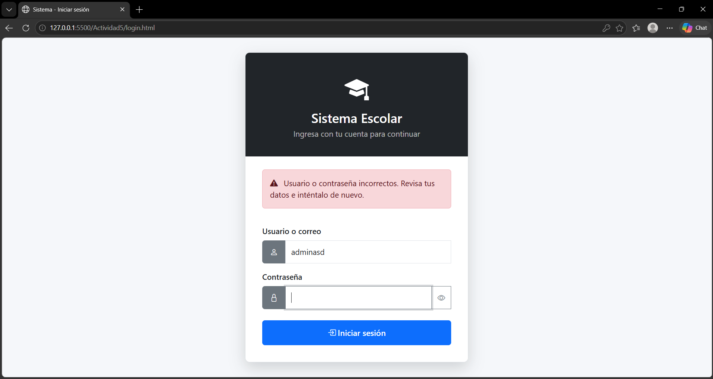

### Paso 3. Armar el navbar con el usuario

En `index.html` se creó un navbar oscuro fijo (`fixed-top`) con el botón hamburguesa, el nombre del sistema y un **dropdown de Bootstrap** a la derecha. El texto del usuario tiene `id="nombreUsuarioNav"` y `index.js` lo reemplaza con el nombre guardado en la sesión. El dropdown incluye la opción **Salir del sistema**.


### Paso 4. Armar el sidebar

Se creó un panel lateral fijo con las opciones **Inicio** y **Usuarios**. "Usuarios" usa el componente **Collapse** de Bootstrap y despliega el submenú **Captura**. El botón hamburguesa alterna las clases del sidebar y del contenido:

```js
btnHamburguesa.addEventListener("click", () => {
  sidebar.classList.toggle("collapsed");
  sidebar.classList.toggle("show");
  content.classList.toggle("expanded");
});
```

En `css/index.css` se usaron variables (`--sidebar-width`, `--navbar-height`) y una regla `@media (max-width: 768px)` para que en celular el sidebar se oculte y aparezca al presionar el botón.


### Paso 5. Formulario con número de control

Al elegir **Usuarios → Captura** se muestra el formulario. Cada campo se valida en dos niveles: atributos HTML5 (`required`, `pattern`, `maxlength`) y JavaScript con `setCustomValidity()`.

| Campo | Validación |
|---|---|
| Nombre de usuario | Mínimo 3 caracteres |
| Correo electrónico | `validarCorreo()` |
| Contraseña | `validarPassword()` |
| **Número de control** | Exactamente **6 dígitos**: `pattern="\d{6}"`, `maxlength="6"` y `/^\d{6}$/` |
| Edad | Entre 1 y 120 |

```js
const numOk = /^\d{6}$/.test(inputNumCtrl.value.trim());
inputNumCtrl.setCustomValidity(numOk ? "" : "error");
```

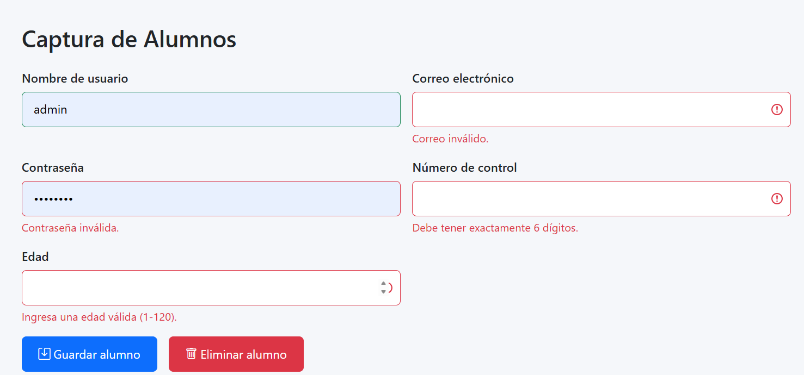


### Paso 6. Modal de edad (mayor y menor de 18)

Al enviar el formulario con datos válidos se evalúa la edad y se muestra un modal de Bootstrap:

- **18 años o más:** se registra el alumno en el arreglo `alumnos`.
- **Menos de 18:** se muestra una advertencia y **no se guarda**.

```js
if (edad < 18) {
  modalEdadBody.innerHTML = `...Menor de edad...`;
  modalEdad.show();
  limpiarFormulario();
  return; // no se agrega al arreglo
}
```

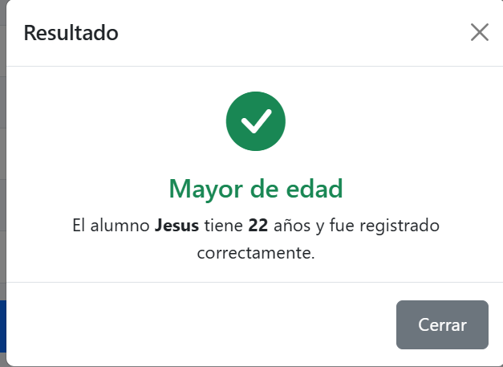

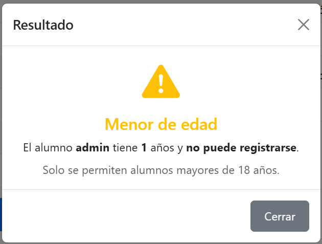

### Paso 7. Modal para eliminar por número de control

Para no eliminar al alumno equivocado cuando hay nombres repetidos, se agregó un segundo modal que pide el **número de control**. Valida los 6 dígitos, busca con `findIndex`, muestra una alerta si no existe y, si existe, lo elimina con `splice` y actualiza `localStorage`:

```js
const index = alumnos.findIndex(a => a.numControl === num);
if (index === -1) { /* alerta: no se encontró */ return; }

alumnos.splice(index, 1);
guardarAlumnos(alumnos);
renderAlumnos();
```

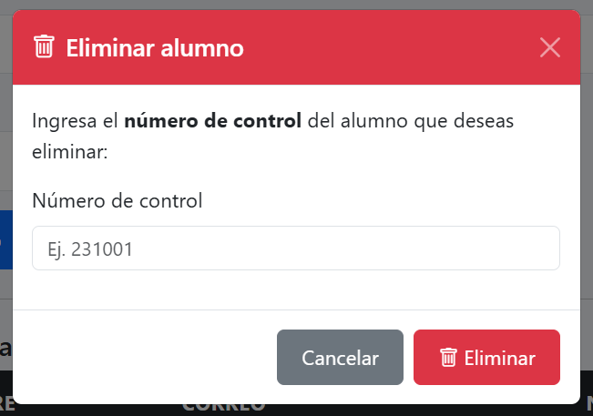

### Paso 8. Persistencia con arreglo + localStorage

Como no hay backend, los alumnos viven en un arreglo de objetos que se guarda en `localStorage` para sobrevivir al cierre del navegador:

```js
function cargarAlumnos() {
  const raw = localStorage.getItem(STORAGE_KEY);
  return raw ? JSON.parse(raw) : [];
}

function guardarAlumnos(arr) {
  localStorage.setItem(STORAGE_KEY, JSON.stringify(arr));
}
```

> ⚠️ `localStorage` es local de cada navegador: los datos no se comparten entre computadoras ni entre usuarios.

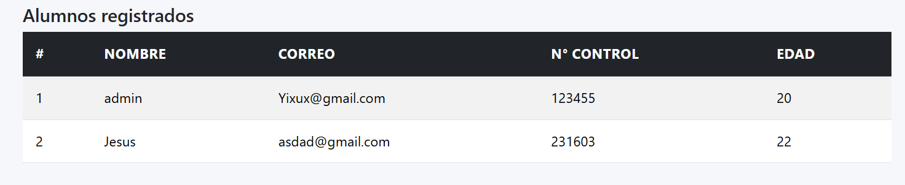

---

## 5. Capturas del flujo completo funcionando

1. **Login:** pantalla de inicio de sesión.

   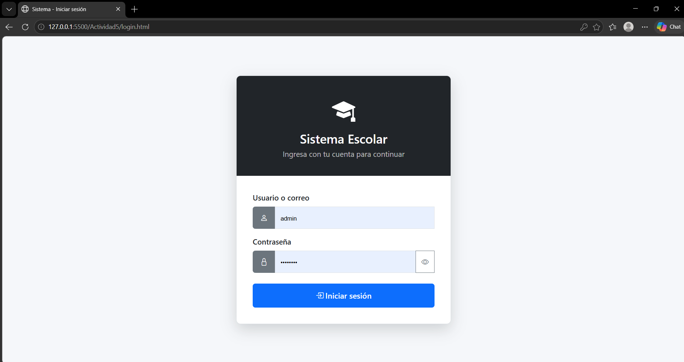

2. **Error de login:** credenciales incorrectas.

   

3. **Panel principal:** después de iniciar sesión, con el nombre del usuario en el navbar.

   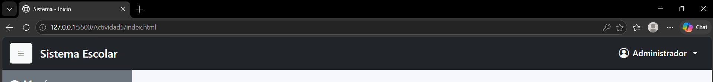

4. **Sidebar:** menú con el submenú Captura desplegado.

   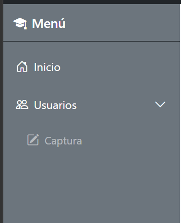

5. **Formulario de captura** con validaciones.

   

6. **Modal mayor de edad:** alumno registrado.

   

7. **Modal menor de edad:** registro rechazado.

   

8. **Tabla de alumnos** registrados.

   

9. **Eliminar alumno** por número de control.

   

10. **Persistencia:** recarga de la página con los datos aún visibles.

    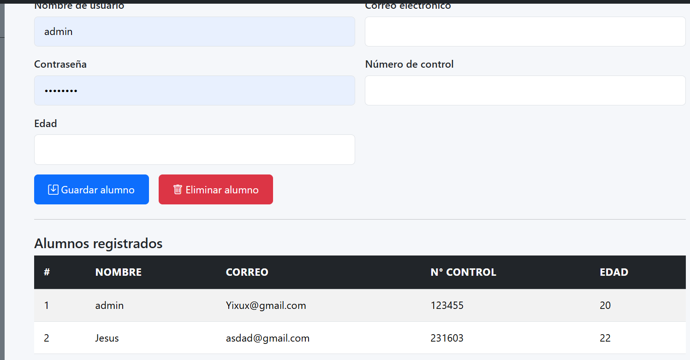

11. **Salir del sistema:** dropdown del usuario y regreso al login.

    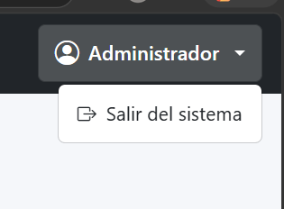

---

## 6. Cómo ejecutar el proyecto

`login.js` usa `fetch()` para leer `data/usuarios.json`, por lo que el proyecto **no debe abrirse con doble clic** (`file:///`). Opciones:

- **XAMPP:** copiar la carpeta a `C:\xampp\htdocs\`, encender Apache y abrir
  `http://localhost/Actividad5/login.html`
- **GitHub Pages:** activar *Settings → Pages* (rama `main`, carpeta `/ (root)`) y abrir
  `https://lordynt.github.io/Actividad5/login.html`

